## [<-Back to main](<Introduction to Linux and ubuntu installation.md>)

# Ubuntu VM installation
Author: Mohamed Elshamy
Maintainer: Abdallah Nomeer
## A- VM Downloading:
> **Note:** Broadcom Completes Acquisition of VMware.

### 1- Open the [link](https://profile.broadcom.com/web/registration) and register on **BROADCOM** website.

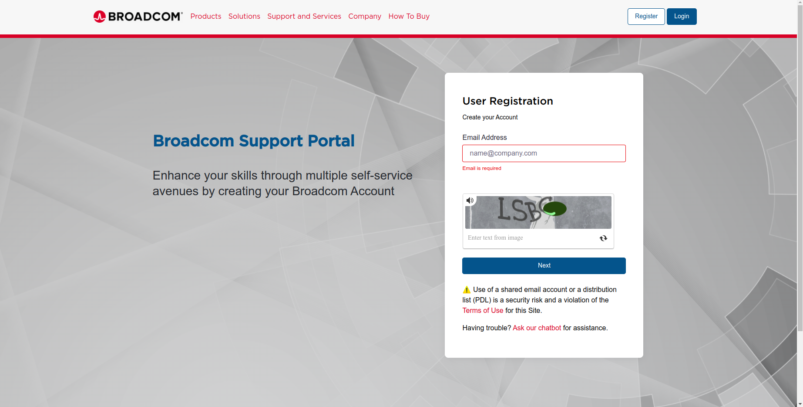

### 2- Go to BROADCOM [support portal](https://support.broadcom.com/group/ecx/downloads) and follow steps.

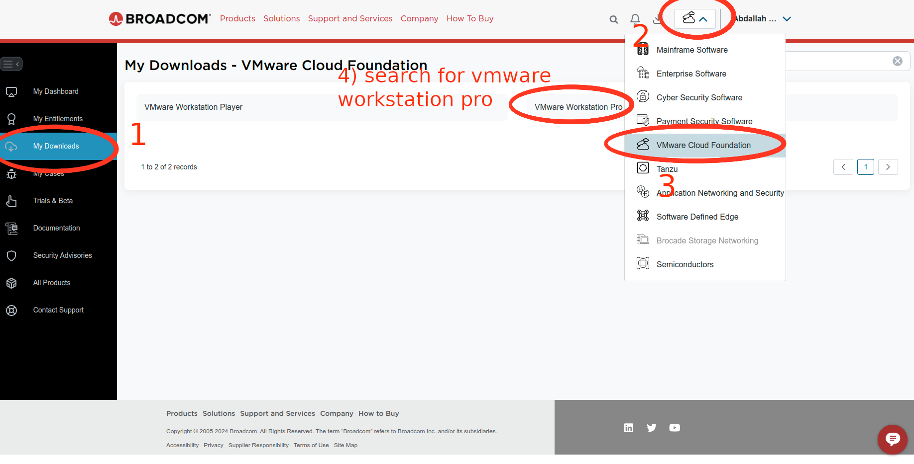

### 3- Choose your operating system with personal use for free edition.
.png)

### 4- Click on download icon to start downloading.

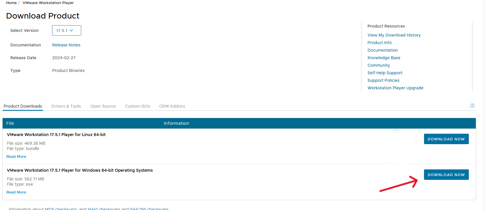

### 5- Install VM on your computer

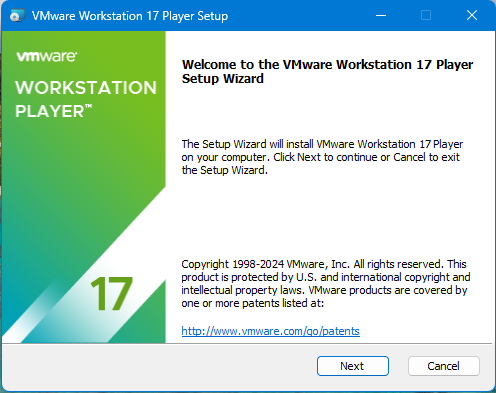

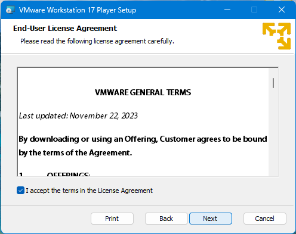

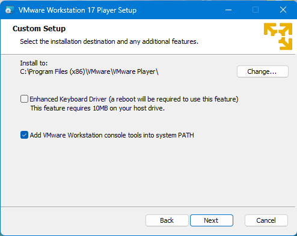

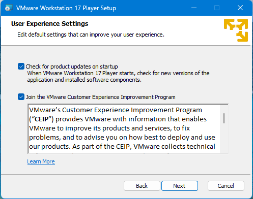

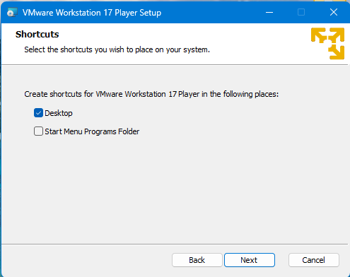

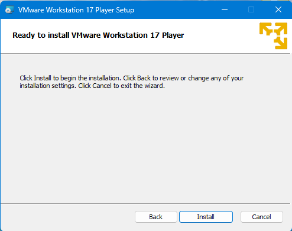

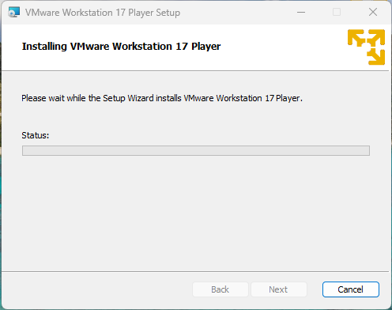

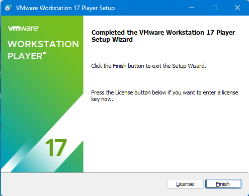

## B- Installing Ubuntu on the VMware

### 1- To downlaod ubuntu-20.04 image Click the [LINK](https://releases.ubuntu.com/focal/) and choose `ubuntu-20.04.6-desktop-amd64.iso` as shown below

  

### 2- Click on *Create a new virtual machine* .

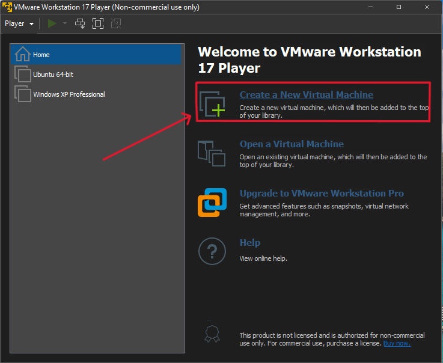

### 3- Choose the image file path for the ubuntu

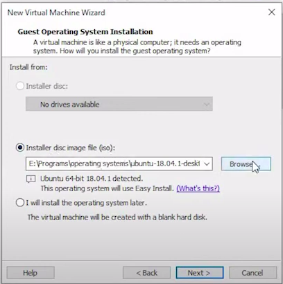

### 4- Set your name, user name and password

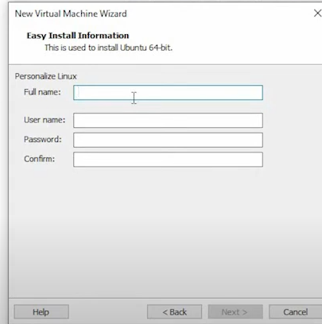

### 5- Set your Virtual machine name and system file location

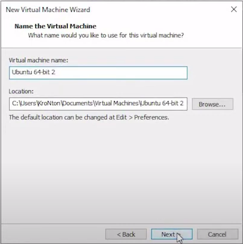

### 6- Set the disk size for the Ubuntu 

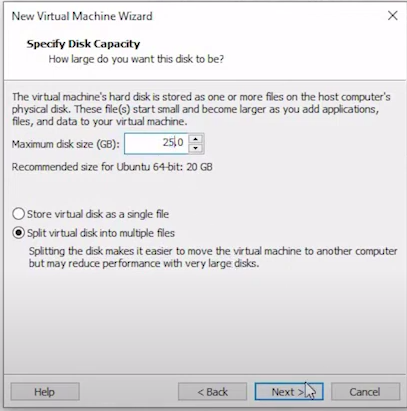

### 7- Click finish 

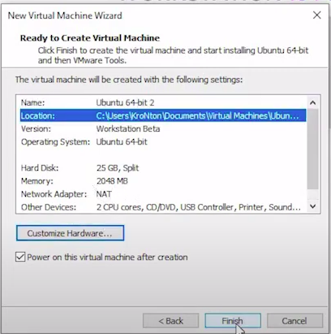

### 8- Then the ubuntu will be installed as shown 

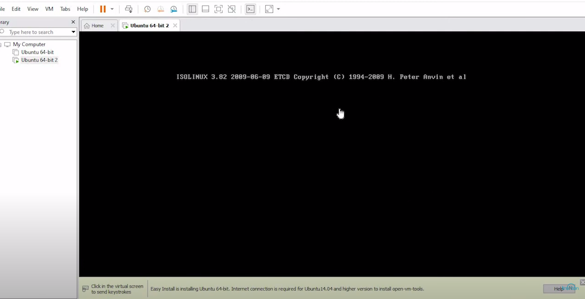

### 9- After Downloading is complete enter the passowrd created later and that's it

## [<-Back to main](<Introduction to Linux and ubuntu installation.md>)

# Refrences

#### 1- Install Ubuntu 18.04 virtual machine https://youtu.be/O5Puwym7K5E?feature=shared

