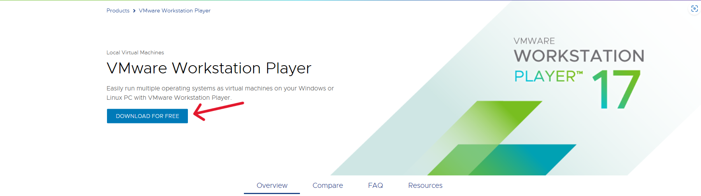
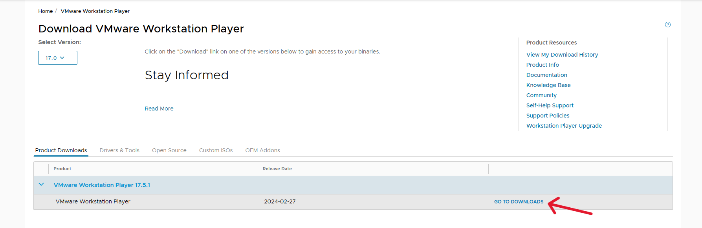
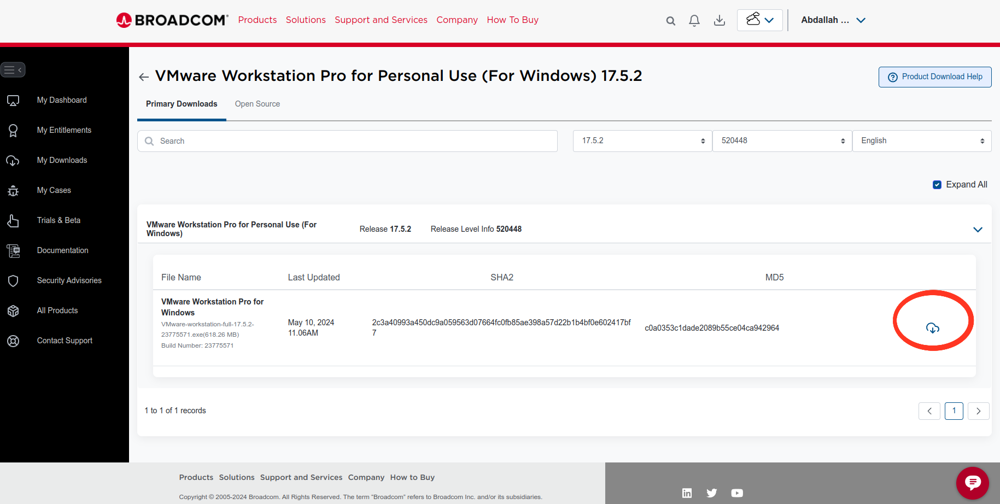

# Ubuntu VM installation
Author: Mohamed Elshamy

## A- VM installation:

### 1- Open the [link](https://www.vmware.com/products/workstation-player.html) and select *DOWNLOAD FOR FREE*.

### 2- Click on *GO TO DOWNLOADS* as shown below.

### 3- Click on *DOWNLOAD NOW* for the windows version of the VMware.

### 4- Install VM on your computer

## B- Installing Ubuntu on the VMware

### 1- To downlaod ubuntu-20.04 image Click the [LINK](https://releases.ubuntu.com/focal/) and choose `ubuntu-20.04.6-desktop-amd64.iso` as shown below

  

### 2- Click on *Create a new virtual machine* .

### 3- Choose the image file path for the ubuntu

### 4- Set your name, user name and password

### 5- Set your Virtual machine name and system file location

### 6- Set the disk size for the Ubuntu 

### 7- Click finish 

### 8- Then the ubuntu will be installed as shown 

### 9- After installation is complete enter the passowrd created later and that's it

# Refrences

#### 1- Install Ubuntu 18.04 virtual machine https://youtu.be/O5Puwym7K5E?feature=shared

## [↩ Back to main](<Introduction to Linux and ubuntu installation.md>)

