# Introduction To Linux And Its Architecture
Author: Mohamed Elshamy

Review : kyrillos Fekry

The story behind the establishment of Linux is one of a talented computer programmer named Linus Torvalds who, in 1991, set out to create a free and open-source operating system kernel as a personal project.

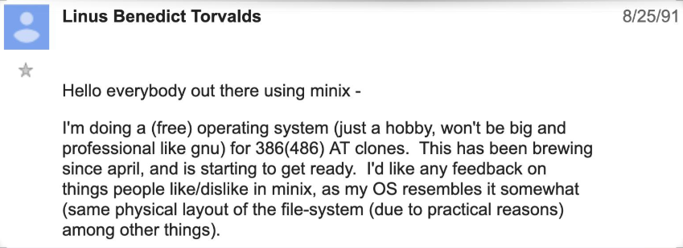
## What is Linux ?
* Linux is an open-source operating system that is widely running in servers, supercomputers, and embedded systems. 

* It was first released in 1991 by Linus Torvalds and is based on the Unix operating system. 

* Linux is known for its stability, security, and flexibility, and it is available in many different distributions, such as Ubuntu, Fedora, and Debian. 
 

## Why Linux:
* ### Free, Safe, and Robust. 
* ### Large device drivers’ coverage.
* ### Hosting a huge number of languages & libraries.
* ### Large Community.
* ### Support ROS

## Linux vs Windows: 

Linux and Windows are two different operating systems with their own unique features and functionalities. Here are some differences between them : 

* ### Open-source vs. proprietary
  * Linux is an open-source operating system, which means that its source code is freely available to the public, and anyone can modify and distribute it. 

  * Windows, on the other hand, is a proprietary operating system, which means that its source code is not available to the public, and only Microsoft can modify and distribute it. 
* ### Architecture 
  Linux and Windows have different kernel architectures. 

  * Linux uses a monolithic kernel architecture, which means that all the operating system’s services run in kernel space. 
  
    - The kernel is responsible for managing the system’s resources, such as memory, CPU, and input/output devices. 
    
    - The kernel communicates with the user-space through system calls, which are a way for user-space programs to request services from the kernel 12. 

  * Windows, on the other hand, uses a hybrid kernel architecture, which means that some of the operating system’s services run in kernel space, while others run in user space.

    - The kernel is responsible for managing the system’s resources, such as memory, CPU, and input/output devices, and it communicates with the user-space through system calls 

* ### User interface
  * Linux has a variety of user interfaces, such as GNOME, KDE, and Xfce, which can be customized according to the user’s preferences. 

  * Windows has a consistent user interface across all versions, which is designed to be user-friendly and easy to navigate. 

* ###  Software availability
  
  * Linux has a vast library of open-source software that can be downloaded and installed for free. 

   * Windows has a larger market share than Linux, which means that more software is developed for Windows. 

* ### Security 
  * Linux is known for its security and stability, and it is less vulnerable to viruses and malware than Windows.

  * Windows, on the other hand, is more susceptible to viruses and malware due to its popularity and market share. 
 
* ###  Cost: 
  * Linux is free and open-source, which means that it can be downloaded and installed for free. 
  
  * Windows, on the other hand, is a proprietary operating system that requires a license to use. 

# Ubuntu Dualboot Installation
The destripution of Linux that we are going to install is `Ubuntu20.04`
## A- Downloading the ubuntu 20.04 file:
### Click the [LINK](https://releases.ubuntu.com/focal/) and choose `ubuntu-20.04.6-desktop-amd64.iso` as shown below

  
## B- Flash the ubuntu file in the drive:
 ### 1. Download [balenaEtcher](https://etcher.balena.io/)
  
  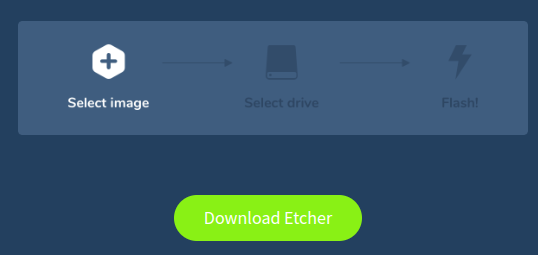

 ### 2. Select the ubuntu image
  
  

 ### 3. Select the drive
  
  
  
 ### 4. Click Flash and wait untill it finishes

  

## C -  Setup partitions:
 ### 1. Serch for disk management in the search and open it

  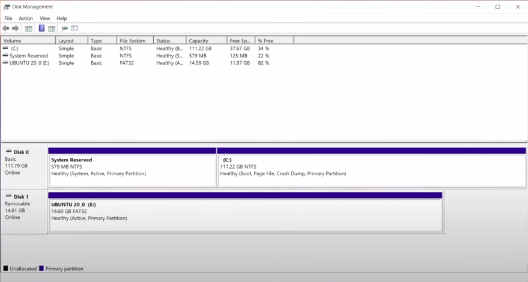

 ### 2. Select the choosen drive to be shrink and right click it and click shrink

  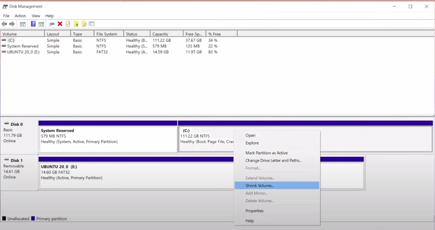

 ### 3. Set the disk space and click shrink

  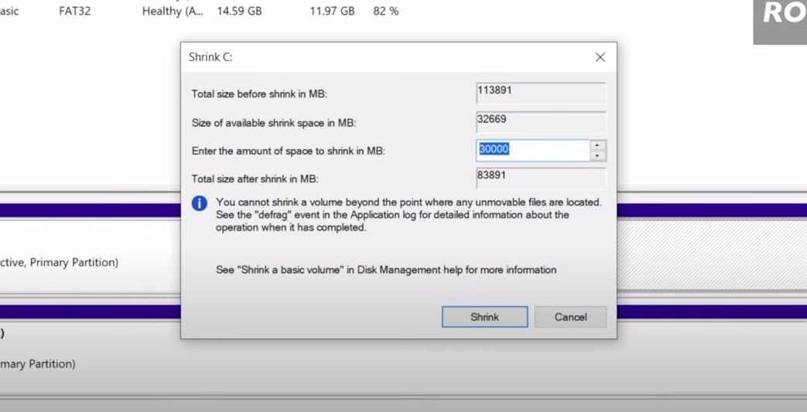

 ### 4. Then it should be like that

  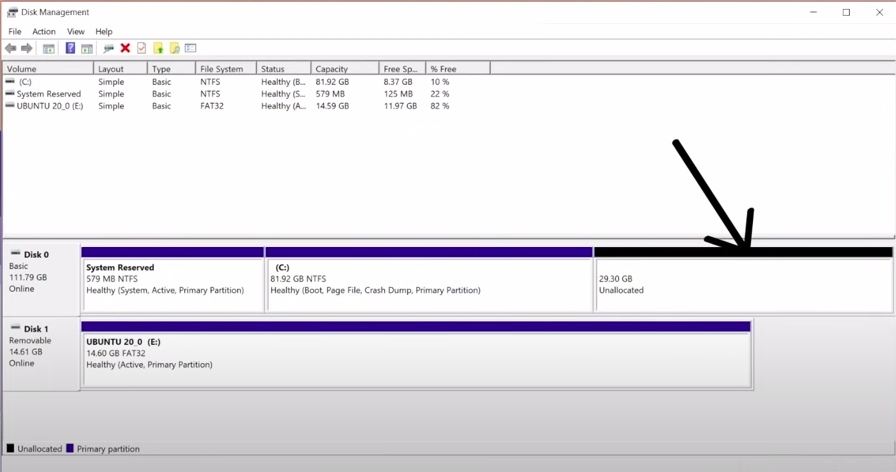

## Installing Ubuntu:
 ### 1. Restart the device and press F12 (may vary from device to other) to open the BIOS
 ### 2. Select the boot menu and select the flashed drive
  
  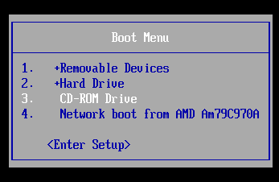

 ### 3. Continue installing untill installation window apears and select somthing else 

  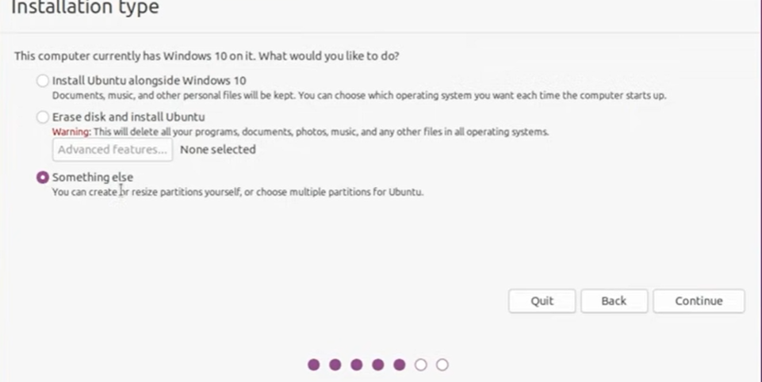
  
 ### 4. Select the free space and then press the + sign below 

  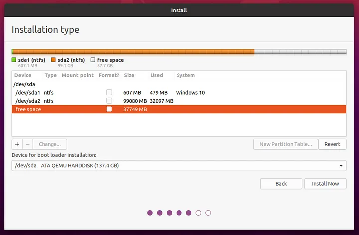

 ### 5. The first partition you will make is the SWAP partition. 

  * It serves as an extension to your RAM (Random Access Memory) which is the fast memory which it needs immediately to function. 
  
    If your RAM is full, Ubuntu will then save additional data in the SWAP.

    ### Note:

         Most guides I know of recommend to use double the size of your RAM for your SWAP partition and at least the same amount of memory as your RAM. 
        
        Technically, you can do without SWAP at all, but it doesn’t hurt to have some SWAP in case your RAM is not that big. 
        Most systems nowadays have at least 8 GB of RAM.

        The more RAM you have, the less likely you need the SWAP memory. On this computer, I have 8 GB of RAM. Therefore, I use 4 GB for this installation. That should be enough. 

 ### 6. Choose “Logical” for the partition type and select “swap area” from the drop down menu. Then clock “OK”.
  
  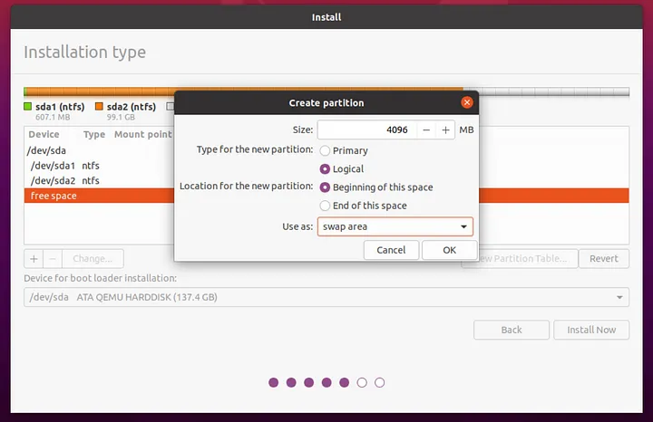

 ### 7. Next, you need the so called “root” partition which hosts all your system files necessary by Ubuntu to function.
  * By default, this partition will also contain your personal files, but here we will create a separate partition only for your personal files, such as your “Downloads” folder or “Music” folder. This is why we need to create two more partitions.

  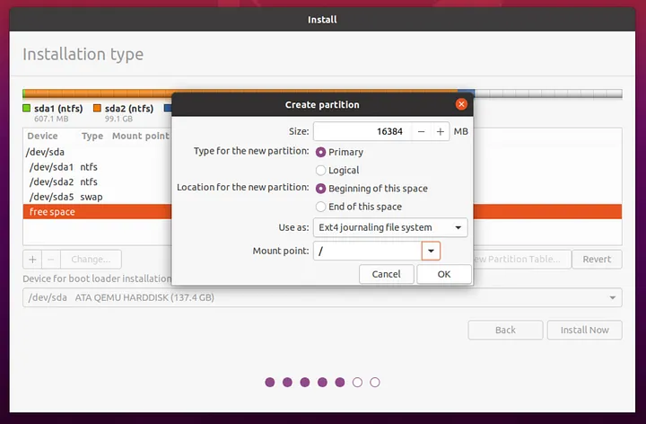

 ### 8. Your last partition will be the “home” partition.
 *  Again, click on the plus icon to create a new partition and dedicate the remaining space to this partition. Again, select it to be a “Logical” partition and again choose the “Ext4” file system. 
 
    This time, the mount point is “/home”. this partition will store all your personal files. If you do not create a separate “home” partition, your personal files will be stored inside the “root” partition

  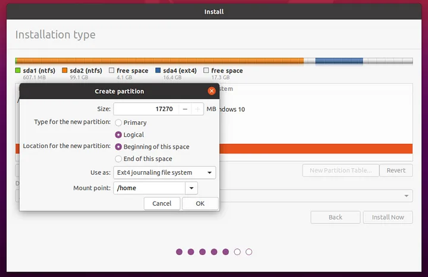

 ### 9. Then set your time, username and password.
 ### 10. After installation is done remove the drive and reboot ubuntu  

# [Hands-on: Ubuntu VM Installation](<Hands-on Ubuntu VM Installation.md>)

# References:
### [- Dualboot Linux Ubuntu 20.04 installation form Medium.com ]([https://releases.ubuntu.com/focal/](https://medium.com/linuxforeveryone/how-to-install-ubuntu-20-04-and-dual-boot-alongside-windows-10-323a85271a73)https://medium.com/linuxforeveryone/how-to-install-ubuntu-20-04-and-dual-boot-alongside-windows-10-323a85271a73)

 

## [Next Topic →](<../Learn Shell Tools and Scripting/README.md>)

## [↩ Back to main](../README.md)

