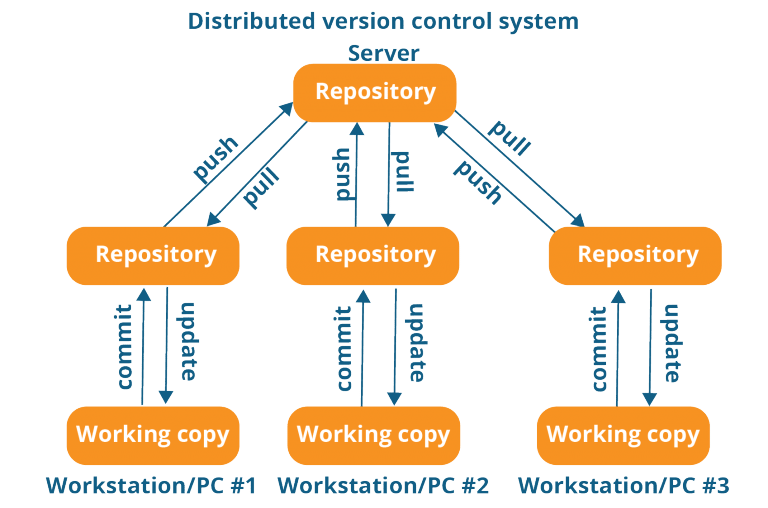
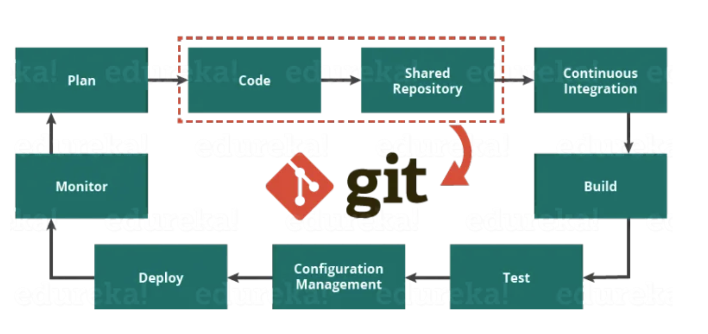
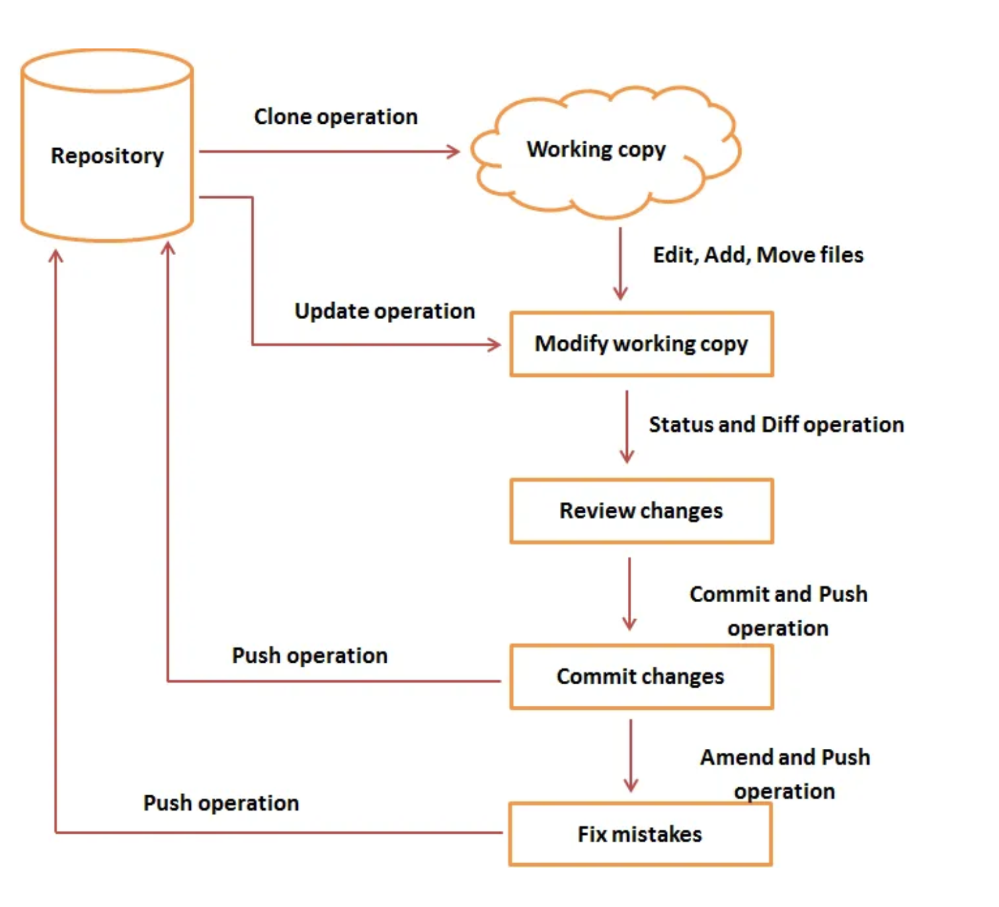
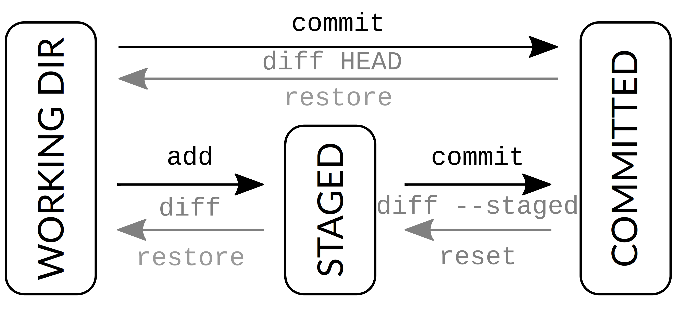
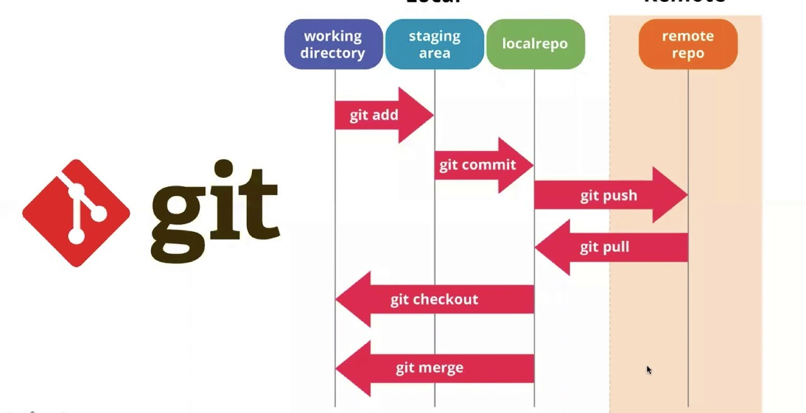
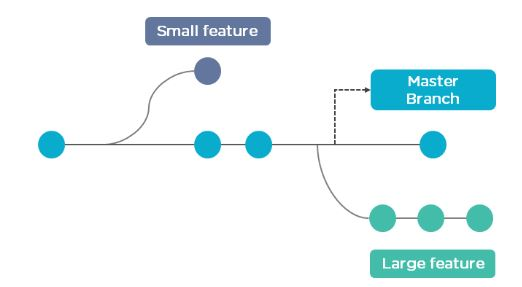

# Version Control (GIT)

Author: Mahmoud Okasha

Review: Khaled Gabr, Shrif Fathy , Kyrillos Fekry

## 1 - What is Git ?

`Git` is a free and open-source version control system, originally created by Linus Torvalds in 2005.



## 2 - What is Git used for ?

- Tracking code changes
- Tracking who made changes
- Coding collaboration



## 3 - What does Git do ?

- Manage projects with Repositories
- Clone a project to work on a local copy
- Control and track changes with Staging and Committing
- Branch and Merge to allow for work on different parts and versions of a project
- Pull the latest version of the project to a local copy
- Push local updates to the main project



## 4 - Git’s data model

- Git’s data model is a way of organizing and storing the changes made to a project’s source code over time.
- It uses a directed acyclic graph to represent the commit history of a project .
- Each commit is a snapshot of the project at a particular point in time, and each commit has a unique identifier that allows it to be referenced later.

It may be instructive to see Git’s data model written down in pseudocode:

```cpp
// a file is a bunch of bytes
type blob = array<byte>

// a directory contains named files and directories
type tree = map<string, tree | blob>

// a commit has parents, metadata, and the top-level tree
type commit = struct {
    parents: array<commit>
    author: string
    message: string
    snapshot: tree
}
```

## Example about how Git’s data model works



---

## 5 - What is GitHub ?

- **Git** is **not** the same as **GitHub**.

- GitHub acts as the hub where all things related to Git revolve.

- GitHub is the world's largest host of source code and has been owned by Microsoft since 2018.

## 6 - Git Getting Started

## A - Git Install

```bash
sudo apt-get update
sudo apt-get install git
git --version
# git version 2.9.2
```

### B - Configure Git

Configure your Git username and email using the following commands, replacing Emma's name with your own. These details will be associated with any commits that you create:

```bash
git config --global user.name "Emma Paris"

git config --global user.email "eparis@atlassian.com"
```

### C - What is a Git repository ?

A `Git` repository is a virtual storage of your project. It allows you to save versions of your code, which you can access when needed.

# [Hands-on: Initializing a new repository](./Hands-on:Initializing-a-new-repository.md)


## E - Cloning an existing repository

The URL of repository that will clone is `https://github.com/arab-meet/1.Robotics-Tools-Workshop` change the link to the link of your repo that you clone.

```bash
git clone https://github.com/arab-meet/1.Robotics-Tools-Workshop.git
```

## F - Checking the Status of Your Files

Files in your Git repository folder can be in one of 2 states:

- #### Tracked - files that Git knows about and are added to the repository

- #### Untracked - files that are in your working directory, but not added to the repository

  ```bash
  git status
  ```

## G - Saving changes to the repository

Now that you have a repository cloned or initialized, you can commit file version changes to it.

```bash
cd repo

touch CommitTest.txt

echo "test content for git tutorial" >> CommitTest.txt

git add CommitTest.txt

git commit -m "added CommitTest.txt to the repo"
```

## H - Undoing or discarding uncommitted local changes

```bash
cd repo

touch restoreTest.txt

echo "test git restore command from git tutorial" >> restoreTest.txt

git add restoreTest.txt

git restore --staged restoreTest.txt
```

## I - Removing untracked files

- ### This command don’t actually remove anything, just show what would be done

  ```bash
  git clean -n
  ```

- ### This command force the operation and delete files without prompting

  ```bash
  git clean -f
  ```

## J - Push the changes to remote repository

The branch that we will push into it in the remote repository is `main`
`bash
    git push -u origin main
    `



## K - Branching and Merging

Git’s branching model allows you to work on features, fixes, and experiments independently, and merging ties everything together.



# [Hands-On: Managing Git Branches ](./Hands-On:Managing-Git-Branches.md)

# [Git Cheat Sheet](Git-Cheat-Sheet.md)

## [Next Topic →](../VSCode/README.md)

## [↩ Back to main](../README.md)
